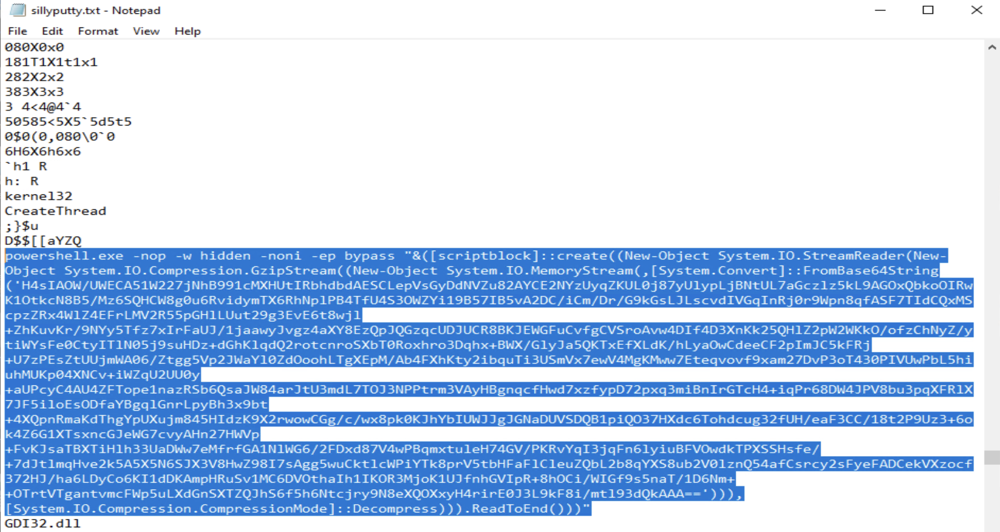
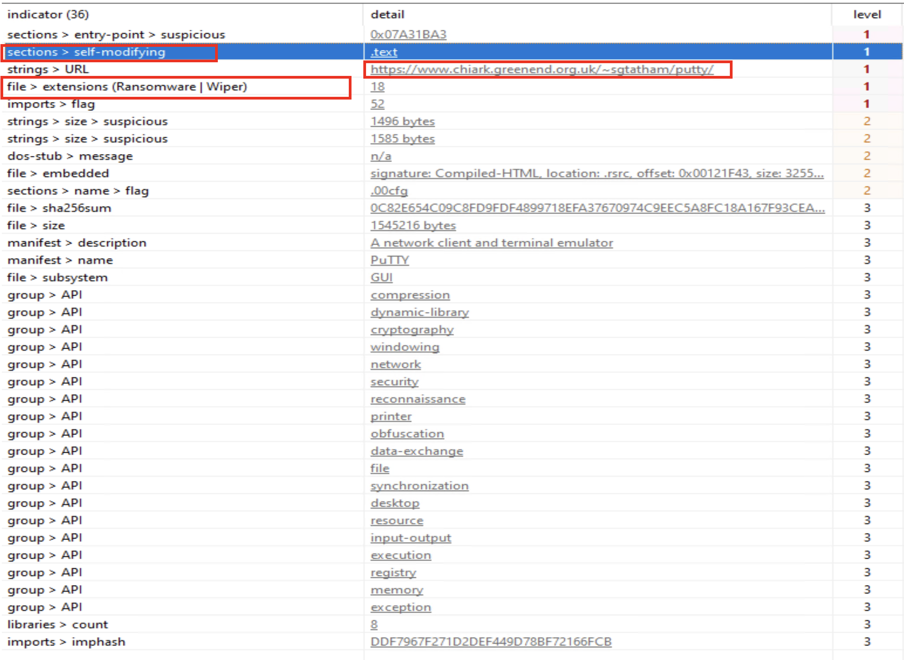

# Malware Analysis — Basic Static Analysis (Silly Putty)

**Course:** Practical Malware Analysis & Triage (PMAT) — TCM Security
**Type:** Static analysis (no execution)
**Environment:** Isolated VMs (VMware)

## Overview
Basic static analysis identified clear indicators of compromise, including a malicious domain (bonus2.corporatebonusapplication[.]local) and suspicious network activity on port 8443. These findings indicate the PuTTY binary was trojanized and capable of remote command execution. A full forensic review is recommended to identify persistence mechanisms and any additional unauthorized activity.

## Tools Used
- PEStudio
- FLOSS
- REMnux
- VirusTotal (hash reputation)

## Key Findings
- Domain: bonus2.corporatebonusapplication[.]local
- Port: 8443
- Suspicious PowerShell loader (base64 + gzip)

## Evidence (Screenshots)

## References
- Course: https://academy.tcm-sec.com/p/practical-malware-analysis-triage
- PMAT labs: https://github.com/HuskyHacks/PMAT-labs/tree/main
